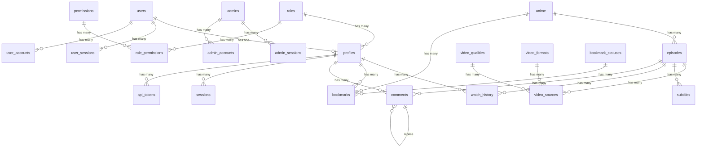

# Project Database Schema

This document defines the database schema conventions, table catalog, relationship map, client initialization patterns, and migration workflows for the GoxStream anime streaming platform.

**Engine**: Cloudflare D1 (SQLite)
**ORM**: Drizzle ORM 0.45.2
**Schema Source**: [`src/infrastructure/database/schema/`](../src/infrastructure/database/schema/) (Modular: `auth.ts`, `users.ts`, `anime.ts`, `media.ts`, `interactions.ts`, `system.ts`)
**Migration Output**: `src/infrastructure/database/migrations/`
**Drizzle Config**: [`drizzle.config.ts`](../drizzle.config.ts)
**Client Module**: [`src/infrastructure/database/client.ts`](../src/infrastructure/database/client.ts)

---

## Schema Conventions

### Primary Keys
- Always `text("id").primaryKey()` using string-based identifiers (UUIDs or semantic slugs like `'superadmin'`, `'1080p'`, `'hls'`).
- Never use auto-increment integer primary keys.
- Composite primary keys use `primaryKey({ columns: [t.colA, t.colB] })` in the table's third argument.

### Timestamps
- Stored as Unix epoch seconds using `integer("column_name", { mode: "timestamp" })`.
- Default value: `.default(sql\`(strftime('%s', 'now'))\`)`.
- Common timestamp columns: `created_at`, `updated_at`, `expires_at`, `last_used`, `aired_at`, `added_at`.

### Booleans
- Stored as SQLite integers using `integer("column_name", { mode: "boolean" })`.
- Always provide an explicit default: `.default(false)`.

### JSON Columns
- Stored as text with JSON mode: `text("column_name", { mode: "json" }).$type<T>()`.
- Example: `genres: text("genres", { mode: "json" }).$type<string[]>().notNull()`.

### Enum-like Columns
- Modeled as string union types: `text("column_name").$type<"A" | "B" | "C">()`.
- No native SQLite enum support -- validation happens at the application layer.
- Examples:
  - `status: text("status").$type<"Ongoing" | "Completed" | "Upcoming">()`
  - `quarter: text("quarter").$type<"Winter" | "Spring" | "Summer" | "Fall">()`

### Column Naming
- SQL column names use `snake_case` (e.g., `created_at`, `anime_id`, `is_spoiler`).
- TypeScript property names use `camelCase` (e.g., `createdAt`, `animeId`, `isSpoiler`).
- Drizzle handles the mapping automatically via the column name string argument.

### Foreign Keys
- Always declared inline on the column definition using `.references(() => targetTable.id, { onDelete: "cascade" | "restrict" })`.
- `cascade`: Used when the child record has no meaning without the parent (e.g., episodes belong to anime).
- `restrict`: Used when the referenced record is a lookup/classification that should not be deleted while in use (e.g., `video_qualities`, `bookmark_statuses`, `roles`).
- Never use `onDelete: "set null"`.

### Nullability
- Columns are nullable by default in Drizzle. Explicitly call `.notNull()` on every column that must have a value.
- Optional columns (e.g., `image`, `synopsis`, `thumbnailKey`) omit `.notNull()`.

---

## Table Catalog

### Auth & Access Control

| Table | Primary Key | Description |
|-------|-------------|-------------|
| `roles` | `text id` (semantic: `'superadmin'`, `'user'`) | Role definitions for RBAC |
| `permissions` | `text id` (semantic: `'settings:update'`) | Granular permission definitions |
| `role_permissions` | composite (`role_id`, `permission_id`) | Many-to-many join between roles and permissions |

### Better Auth -- User

| Table | Primary Key | Description |
|-------|-------------|-------------|
| `users` | `text id` | Core user accounts managed by Better Auth |
| `user_sessions` | `text id` | Active user session tokens with expiry |
| `user_accounts` | `text id` | OAuth provider link records (Google, GitHub, etc.) |
| `user_verifications` | `text id` | Email/phone verification tokens |

### Better Auth -- Admin

| Table | Primary Key | Description |
|-------|-------------|-------------|
| `admins` | `text id` | Admin accounts, fully separated from user accounts |
| `admin_sessions` | `text id` | Active admin session tokens |
| `admin_accounts` | `text id` | Admin OAuth provider link records |
| `admin_verifications` | `text id` | Admin verification tokens |

### User Profile (Decoupled)

| Table | Primary Key | Description |
|-------|-------------|-------------|
| `profiles` | `text id` (FK to `users.id`) | Extended user profile data decoupled from auth. Contains `username`, `display_name`, `avatar_url`, `role_id`, `password_hash` |

### Anime Metadata

| Table | Primary Key | Description |
|-------|-------------|-------------|
| `anime` | `text id` | Anime titles with metadata (`title`, `slug`, `cover_image`, `banner_image`, `synopsis`, `genres` JSON, `year`, `quarter`, `status`, `rating`, `popularity`) |

### Content & Streaming

| Table | Primary Key | Description |
|-------|-------------|-------------|
| `episodes` | `text id` | Episode entries per anime. Unique constraint on (`anime_id`, `episode_number`) |
| `video_qualities` | `text id` (semantic: `'360p'`, `'1080p'`) | Quality tier lookup table |
| `video_formats` | `text id` (semantic: `'hls'`, `'mp4'`) | Format type lookup table |
| `video_sources` | `text id` | Actual video file references linking episode + quality + format. Contains `file_key`, `url`, `file_size`, `is_primary` |
| `subtitles` | `text id` | Subtitle file references per episode (`language`, `label`, `file_key`) |

### User Interaction

| Table | Primary Key | Description |
|-------|-------------|-------------|
| `watch_history` | composite (`user_id`, `episode_id`) | Per-user episode viewing progress (`progress` seconds, `completed` flag) |
| `bookmark_statuses` | `text id` (semantic: `'watching'`, `'plan'`) | Bookmark status lookup with optional `color` |
| `bookmarks` | composite (`user_id`, `anime_id`) | Per-user anime bookmark with status reference |
| `comments` | `text id` | Threaded episode comments with `parent_id` self-reference, `is_spoiler` flag, and soft-delete via `is_deleted` |

### System

| Table | Primary Key | Description |
|-------|-------------|-------------|
| `site_settings` | `text key` | Key-value store for site-wide configuration |
| `sessions` | `text id` | Custom application sessions (distinct from Better Auth sessions) |
| `api_tokens` | `text id` | Named API access tokens per user with `last_used` tracking |

---

## Relationship Map



---

## Relationship Conventions

### Declaration Pattern
- Every table that participates in a relationship has a separate `*Relations` export immediately following the table definition.
- Relation exports are named by appending `Relations` to the table variable name (e.g., `animeRelations`, `episodesRelations`).

### Association Types
- **`one()`**: Defines a belongs-to or has-one association. Requires `fields` and `references` to specify the join columns.
- **`many()`**: Defines a has-many association. No join columns needed -- Drizzle infers them from the corresponding `one()` declaration on the other side.

### Self-Referential Relations
- Used for threaded comments: `comments.parentId` references `comments.id`.
- Requires a `relationName` string to disambiguate the two sides:
  ```typescript
  parent: one(comments, {
    fields: [comments.parentId],
    references: [comments.id],
    relationName: "replies",
  }),
  replies: many(comments, { relationName: "replies" }),
  ```

### Composite Primary Keys
- Tables without a single-column primary key use `primaryKey({ columns: [t.colA, t.colB] })` inside the table's third argument callback.
- Used by: `role_permissions`, `watch_history`, `bookmarks`.

---

## Index & Constraint Conventions

### Index Declaration
- Indexes are defined in the table's third argument callback function.
- Syntax: `(table) => [index("index_name").on(table.column)]`

### Naming Pattern
- Index names follow: `{table}_{column}_idx`
- Examples: `user_sessions_userId_idx`, `admin_accounts_userId_idx`, `user_verifications_identifier_idx`

### Current Indexes

| Table | Index Name | Column(s) |
|-------|-----------|-----------|
| `user_sessions` | `user_sessions_userId_idx` | `userId` |
| `user_accounts` | `user_accounts_userId_idx` | `userId` |
| `user_verifications` | `user_verifications_identifier_idx` | `identifier` |
| `admin_sessions` | `admin_sessions_userId_idx` | `userId` |
| `admin_accounts` | `admin_accounts_userId_idx` | `userId` |
| `admin_verifications` | `admin_verifications_identifier_idx` | `identifier` |

### Unique Constraints
- Single-column: `.unique()` chained on the column definition (e.g., `email`, `slug`, `username`, `token`).
- Multi-column: `unique().on(t.colA, t.colB)` in the table's third argument (e.g., `episodes` has unique on `anime_id` + `episode_number`).

---

## Client Initialization Pattern

The database client is initialized via a **lazy proxy pattern** to prevent `getCloudflareContext()` from being called during module evaluation at build time. This is required because OpenNextJS/Cloudflare does not make bindings available until request time.

### Usage

```typescript
import { db } from "@/db";

// Use db directly -- the proxy defers initialization until first property access
const result = await db.query.anime.findMany();
```

### Implementation ([`src/infrastructure/database/client.ts`](../src/infrastructure/database/client.ts))

```typescript
import { getCloudflareContext } from "@opennextjs/cloudflare";
import { drizzle } from "drizzle-orm/d1";
import * as schema from "./schema";

export function getDb() {
  const { env } = getCloudflareContext();
  return drizzle(env.DB, { schema });
}

// Inisialisasi lazy proxy -- menghindari pemanggilan getCloudflareContext() di tingkat teratas
export const db = new Proxy({} as ReturnType<typeof getDb>, {
  get(target, prop, receiver) {
    const actualDb = getDb();
    const value = Reflect.get(actualDb, prop);
    if (typeof value === "function") {
      return value.bind(actualDb);
    }
    return value;
  },
});
```

> [!WARNING]
> Never call `getCloudflareContext()` or `getDb()` at module top level. Always use the exported `db` proxy or call `getDb()` inside a function body that runs at request time.

---

## Migration Workflow

### 1. Edit Schema
Modify table definitions inside the appropriate modular schema file under [`src/infrastructure/database/schema/`](../src/infrastructure/database/schema/).

### 2. Generate Migration
```bash
npx drizzle-kit generate
```
This produces a new SQL file in `src/infrastructure/database/migrations/` (e.g., `0002_awesome_name.sql`).

### 3. Apply Migration Locally
```bash
npx wrangler d1 execute DB --local --file=src/infrastructure/database/migrations/0002_awesome_name.sql
```

### 4. Apply Migration to Production
```bash
npx wrangler d1 execute DB --remote --file=src/infrastructure/database/migrations/0002_awesome_name.sql
```

### 5. Regenerate Cloudflare Types
```bash
npm run cf-typegen
```

> [!CAUTION]
> Always apply migrations to local D1 first and verify before pushing to production. D1 migrations are not reversible -- there is no automatic rollback mechanism.

---

## Prohibited Patterns

These rules must never be violated when working with the database:

1. **No raw SQL queries.** Always use the Drizzle ORM query builder or relational query API. Never write `sql\`SELECT ...\`` for data access.

2. **No auto-increment integer primary keys.** All primary keys must be `text("id")` with string-based values.

3. **No top-level `getCloudflareContext()` calls.** Always use the lazy proxy `db` export from `src/infrastructure/database/client.ts`. Direct top-level invocation causes build-time crashes.

4. **No `onDelete: "set null"` foreign keys.** Use only `cascade` (child removed with parent) or `restrict` (prevent parent deletion while children exist).

5. **No inline relation definitions.** Relations must be declared in separate `*Relations` exports, never inside the `sqliteTable()` call.

6. **No direct D1 binding access in domain modules.** Database access must go through the Drizzle client. Cloudflare bindings are isolated to `src/infrastructure/database/client.ts` and `src/cloudflare/`.

7. **No schema changes without migration generation.** Every modification to files in `src/infrastructure/database/schema/` must be followed by `npx drizzle-kit generate` to create a corresponding migration file.

8. **No monolithic schemas.** Do not add tables or relations to a single large monolithic file. Split them into domain-specific partial files (auth, users, anime, media, interactions, system) under `src/infrastructure/database/schema/` and re-export them via `index.ts`.
